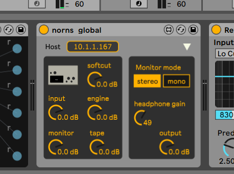
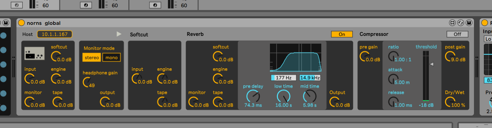

# m4l-monome-norns

m4l device for editing norns global params.

## Usage

Be sure to have your norns connected to the same network as your computer running Ableton.

Find out norns' IP address by toggling the display of technical info, on the 3rd global menu page, by pressing K2.

Simply enter this IP address and you're good to go.

If you want to see norns output level in the compressor controls, route norns' audio in toward the track containing the device.

## Caveats

Right now this device is not bidirectional, i.e. changes made from norns directly won't update displayed values on the device.

The signal levels shown on the compressor will only be accurate when the compressor is turned off. Indeed we capture the signal AFTER the compressor and don't compensate the levels being displayed.

## Social

Discussion on the [dedicated lines thread](https://llllllll.co/t/norns-osc-control-m4l-device/45011).

See also the [device page](https://maxforlive.com/library/device.php?id=7521) on maxforlive.com.
